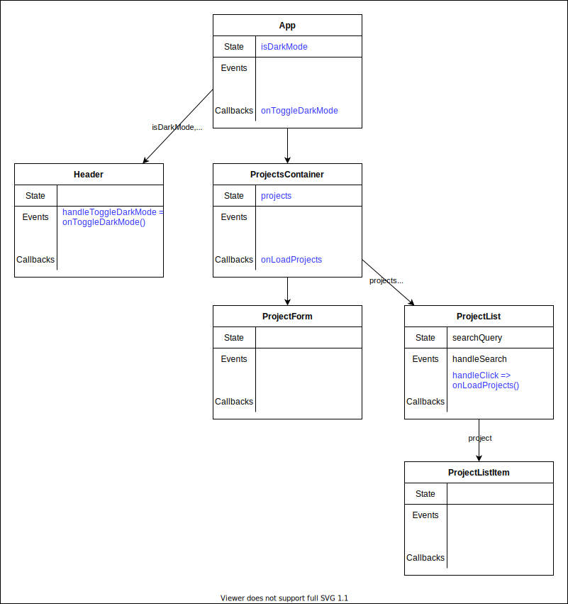

---
presentation:
  width: 1500
  height: 1000
  controls: false
---

<!-- slide -->

<h2><strong> React Information Flow </strong></h2>


https://labs.tadigital.com/index.php/2020/03/31/unidirectional-data-flow-in-react/

<!-- slide -->

<h2><strong> ✅ Objectives </strong></h2>

- Define the term “lifting state”
- Recognize the pattern for changing state in a parent component from a child component
- Explain the role that callback functions play in changing parent state
- Observe how we can render reusable components that invoke different callback functions after an event
- Recognize destructured props and how to work with them

<!-- slide style="text-align: left;" -->

<h2 style="text-align: center;"><strong> Lifting State Up ⬆️ </strong></h2>

<br>

<p style="font-size: 65px";>"In React, sharing state is accomplished by moving it up to the closest common ancestor of the components that need it. This is called <strong>“lifting state up”.</strong>"</p>

https://reactjs.org/docs/lifting-state-up.html

<br>

<!-- slide style="text-align: left;" -->

<h2 style="text-align: center;"><strong> 🤔 Decisions - Where should state be? </strong></h2>

<br>

From [Step 4 of Thinking in React](https://reactwithhooks.netlify.app/docs/thinking-in-react.html#step-4-identify-where-your-state-should-live): To decide where state should live, for each piece of state in your application:

- Identify every component that renders something based on that state.

- Find a common owner component (a single component above all the components that need the state in the hierarchy).

- Either the common owner or another component higher up in the hierarchy should own the state.

- If you can’t find a component where it makes sense to own the state, create a new component solely for holding the state and add it somewhere in the hierarchy above the common owner component.

<!-- slide style="text-align: left;" -->

<h2 style="text-align: center;"><strong> Current Data Flow </strong></h2>

<br>

<center></center>

💡 Question 1: Do you see a problem with storing `isDarkMode` in state within the `Header` component?
💡 Question 2: How about storing `projects` in state within the `ProjectList` component?
💡 Question 3: How about storing `searchQuery` in state within the `ProjectList` component?


<!-- slide -->
## Updated Data Flow
<center></center>

<!-- slide style="text-align: left;" -->

<h2 style="text-align: center;"><strong> First Task: Lifting the darkMode state up 🔧 </strong></h2>

<br>

- Currently, we have our isDarkMode state within the Header component.

- What's the problem with that? 

<details>
  <summary>
    Reveal
  </summary>
  <hr/>

  If we want to update the style of the entire application as it changes, we will only cause a re-render to `Header` component and its children. We won't be able to switch the entire app into dark mode

  <hr/>

</details>
<br/>


<!-- slide style="text-align: left;" -->

<h2 style="text-align: center;"><strong> Let's fix it! 😸 </strong></h2>

<br>

1. Lift the `isDarkMode` state to the `App` component. 

2. Create a function `onToggleDarkMode` that will handle updating the value of `isDarkMode` when necessary

3. Pass `isDarkMode` down as a prop to the `Header` component to use as the condition for what text the button will render

4. Pass `onToggleDarkMode` to be used as a callback function when the button is clicked

❓ Why? This allows us to maintain the state and manage its value where the state is defined


<!-- slide style="text-align: left;" -->

<h2 style="text-align: center;"><strong> Diagram </strong></h2>

<center></center>

<!-- slide style="text-align: left;" -->

<h2 style="text-align: center;"><strong> Recap </strong></h2>


First, move the `isDarkMode` to the `App` component:

```js
const App = () => {
  const [projects, setProjects] = useState([]);
  const [isDarkMode, setIsDarkMode] = useState(true);

...
```
<br>

Second, create the `onToggleDarkMode` function that will update the `isDarkMode` state:

```js
const onToggleDarkMode = () => setIsDarkMode(isDarkMode => !isDarkMode);
```

<br>

Third, pass both `isDarkMode` and `onToggleDarkMode` to `Header` as props

```js
<Header isDarkMode={isDarkMode} onToggleDarkMode={onToggleDarkMode} />
```

<!-- slide style="text-align: left;" -->

<h2 style="text-align: center;"><strong> Inside the Header component: </strong></h2>

Destructure the props in the argument and use the variables to render the button text and invoke the callback within your `onClick` event handler:

```js
const Header = ({ isDarkMode, onToggleDarkMode }) => {
  const handleToggleDarkMode = (e) => {
    onToggleDarkMode();
  }

  return (
    <header>
      <h1>
        <span className="logo">{"//"}</span>
        Project Showcase
      </h1>
      <button onClick={handleToggleDarkMode}>{isDarkMode ? "Light Mode" : "Dark Mode"}</button>
    </header>
  );
};

export default Header;
```

<!-- slide -->

## Lifting Projects in State

We need to modify `projects` from `ProjectForm` as well as access it from `ProjectList` so it needs to live in a common parent, in this case, we'll move it to our new `ProjectsContainer` component:

```js
// this needs to move up
const [projects, setProjects] = useState([]);
// as does the function that updates this piece of state
const loadProjects = () => {
  fetch("http://localhost:4000/projects")
    .then((res) => res.json())
    .then((projects) => setProjects(projects));
}
```

<!-- slide -->

## Passing down the props

After lifting state up, we need to pass it down as props to the component where it lived before!

```js
// src/components/ProjectsContainer.js
<ProjectList projects={projects} onLoadProjects={onLoadProjects} />

// src/components/ProjectList.js
const ProjectList = ({ projects, onLoadProjects }) => { 
```

Notice we're renaming `loadProjects` to `onLoadProjects` to indicate that it is a callback function that will be associated with an event handler in a child component. 

Naming convention => `onBehaviorName`

<!-- slide style="text-align: left;" -->

<h2 style="text-align: center;"><strong> 💡 Conclusion: </strong></h2>

Lifting state up allows us to share data across different components without having to redefine that state where it is needed. The lowest common parent component is the best place to create the state and the process of sharing the data is done through the passing of props.

Because this data is now created elsewhere, we also have to be mindful of how the state is managed. Best practice is to always maintain and manage state where it has been defined. In order to do so successfully if behavior lives in a child component but state belongs to a parent component, is through inverse data flow. 

This means creating a callback function in the parent component that will be responsible for updating the state and passing it down as a prop to the child component with the behavior.