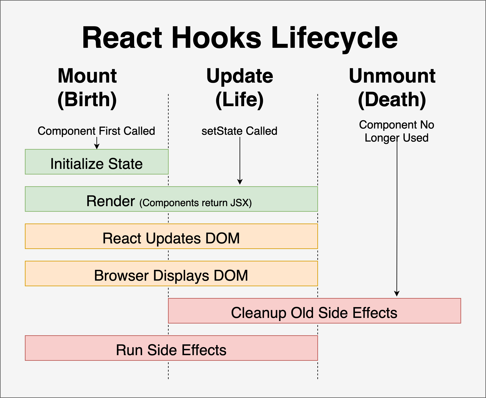

---
presentation:
  width: 1500
  height: 1000
  controls: false
---

<!-- slide -->

<h2><strong> Side Effects and Data Fetching 💻 </strong></h2>

<!-- slide -->

<h2><strong> ✅ Objectives </strong></h2>

- Observe how to send a POST request via form
- Explain what a side effect is
- Observe how React manages side effects with the useEffect hook
- Observe how to use the useEffect hook to fetch data on page load
- Review changing parent state

<!-- slide -->

## Project Showcase Features

- Persist projects to database upon submitting the ProjectForm
- Load all projects from db on component load
- Load all phase 4 projects from db when users click on the phase 4 button
- Load all matching projects from db by phase and value in the search input
- Bonus: Add debouncing to search input so our search input only triggers a single fetch request when we type (rather than sending one for each keystroke)

<!-- slide style="text-align: left;" -->

## Warmup

Let's head over to `src/components/ProjectForm.js` and add in persistence.

### Logistics:
- `cd 05_side_effects_and_data_fetching/project_showcase`
- `npm run server`
- in another terminal: `npm install` then `npm start`

We want to be able to submit the form to create a new project, see the project appear in the DOM, reload the page and see it still appearing on the page!

<!-- slide style="text-align: left;" -->

<h2 style="text-align: center;"><strong> What to know before discussing side effects? </strong></h2>

<br>

The React components we've seen so far are 'pure functions'. This means that given an input(such as a props and state), the return is 100% predictable.

<br>

```js
const Greeting = ({ name }) => {
  return <h1> Hello, {name} </h1>;
};

export default Greeting;
```

<br>

Any time Greeting is called, and provided a new prop, we will always be able to predict the output, regardless of the prop value

<br>

<!-- slide style="text-align: left;" -->

<h2 style="text-align: center;"><strong> What is a side effect? </strong></h2>

<br>

"We perform a side effect when we need to reach outside of our React components to do something. Performing a side effect, however, will not give us a predictable result."

https://www.freecodecamp.org/news/react-useeffect-absolute-beginners/

<br>

The term 'side effect' not only applies to React but to all functional programming.

<br>

“A side effect is anything that affects something outside the scope of the function being executed ” - Michael W. Brady

<br>

💡 These are operations that will still have an effect on our component, but won't happen during the rendering process (they'll happen after)

<br>

<!-- slide -->



<!-- slide style="text-align: left;" -->

<h2 style="text-align: center;"><strong> Examples of side effects</strong></h2>

<br>

- Fetching Data from a server

- Interacting with a browser API like the `document` or `window`
  - Utilizing interval timers such as `setInterval` or `setTimeout` 
  - adding a `mousemove` event listener to the `window` object

<!-- slide style="text-align: left;" -->

<h2 style="text-align: center;"><strong> 🛠️ useEffect() hook </strong></h2>

<br>

- `useEffect()` runs both upon the first render (afterwards) and then with every subsequent re-render. 
- we can limit when the effect will run again by specifying the values for props, state, etc. on which this effect depends

<br>

- Takes in two arguments:

  - A callback function defining the logic to be executed as a side effect(the 'effect')

  - A dependency array that defines when the side effect should occur. This argument is optional and does not always need to be provided

<br>

- `useEffect()` is essentially telling React that the component needs to do something else AFTER the component has rendered

<!-- slide -->

<p style="font-size: 2em">What useEffect Does</p>

- Synchronizes a side effect with a react component's rendering.

<!-- slide style="text-align: left;" -->

<h2 style="text-align: center;"><strong> 1️⃣ useEffect() hook without a dependency array  </strong></h2>

<br>

```js
useEffect(() => {
  // Some effect to occur
});
```

<br>

- In this example, only 1 argument is passed to useEffect

- The dependency array which is the optional second argument is left out

- That means that upon every render and re-render, this side effect will also execute

<!-- slide style="text-align: left;" -->

<h2 style="text-align: center;"><strong> 2️⃣ useEffect() hook with an empty dependency array  </strong></h2>

<br>

```js
useEffect(() => {
  // Some effect to occur
}, []);
```

<br>

- In this example, the dependency array is passed as the second argument

- The dependency array is empty with no provided value

- That means that the side effect will only run one time, upon the initial render of the component and no more after that. Even if the component is re-rendered

<!-- slide style="text-align: left;" -->

<h2 style="text-align: center;"><strong> 3️⃣ useEffect() hook with a value provided to the dependency array  </strong></h2>

<br>

```js
useEffect(() => {
  // Some effect to occur
}, [data]);
```

<br>

- In this example, the dependency array is passed a piece of data. This data can be either a prop or a state variable

- That means that the side effect will run once upon the components initial render and then only re-run when the value of the provided data changes

Let's go use this in our application by:
✅ making sure that the projects we fetch from the database align with the phase we have selected by clicking one of the phase button filters
✅ reworking the search input so it makes calls to our api when we type in the input rather than filtering through local state in react


<!-- slide style="text-align: left;" -->

<h2 style="text-align: center;"><strong> Cleaning up 🧹 </strong></h2>

<br>

- There will be some code that is necessary to clean up after the component is no longer being mounted on the DOM. AKA turning off our side effects

- Why? To avoid 'memory leaks' which means using memory for data that is no longer necessary

- Examples: Timeouts, subscriptions, event listeners

- How? Return a cleanup function from the useEffect callback!

<!-- slide style="text-align: left;" -->

<h2 style="text-align: center;"><strong> Cleanup example </strong></h2>

<br>

```js
const Timer = () => {
  const [count, setCount] = useState(0);

  useEffect(() => {
    let timer = setInterval(() => {
      setCount((count) => count + 1);
    }, 1000);

    return () => clearInterval(timer);
  }, []);

  return <h1>I've rendered {count} times!</h1>;
};
```

<br>

[Codesandbox example](https://codesandbox.io/s/useeffect-cleanup-ig17kd?file=/src/Timer.js)

<!-- slide -->

## When does cleanup happen?

  - During an update, if the side effect function will run again on this re-render, then the cleanup function will run first before the effect happens again.

  - When the component unmounts (is removed from the DOM)

  

<!-- slide -->

  **NOTE:** In Development when using React `StrictMode` (which we are):
  - components will be doubled rendered when they first mount to help you spot errors more easily 
  - the component will go through a mount and update right away
  - In the codesandbox demo, I removed Strict Mode so we can more easily understand what's happening with the cleanup.
  - In your own development it may seem like the cleanup function is running right when the component loads. The double render from StrictMode is the reason.

<!-- slide -->

## Debouncing

The problem:
- Right now a separate fetch request is sent to the server for every character we type into the search input - this causes janky rendering and multiple unnecessary repaints of the ProjectList component

The solution
- Debounce the search input!
  - use a separate piece of state to manage the search input
  - when that piece of state changes, schedule a change to the state variable that will trigger the fetch request for 300 milliseconds in the future
  - cancel the previously scheduled update to that state variable 

<!-- slide -->


<!-- slide -->


<!-- slide -->


<!-- slide -->


<!-- slide -->


<!-- slide -->


<!-- slide style="text-align: left;" -->

<h2 style="text-align: center;"><strong> 💡 Conclusion </strong></h2>

<br>

- Side effects run after first render
- Side effects run after every subsequent render where one of the values in their dependency array changes
- Any time a side effect function refers to a value in state or props, that value should be included in its dependency array (follow the eslint hints in your editor)
- If your side effect interacts with an external API or a native browser API like setInterval or setTimeout make sure to return a cleanup function to avoid memory leaks
- useEffect with an empty dependency array is your go to tool for fetching data when a component first loads

<br>

<!-- slide -->

